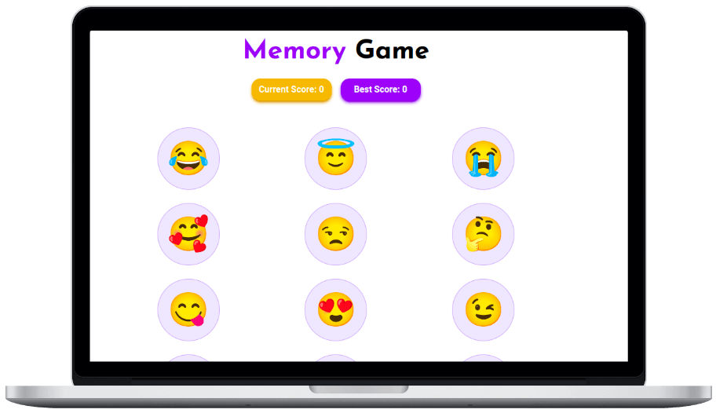

# Memory-Game



A memory card game created with React.

## What's the game ?

As the name suggests, it is a game to test players' memory. The emojis shuffle after every selection. The **goal** is to maximize your score by not selecting the same emoji again. The game shows the current and best score of a player.

:point_right: **Play it [here](https://sneharatnani.github.io/memory-game/)**

## Technologies Used

- React
- tailwind CSS
- Jest
- Testing Library

### Quick Start :rocket:

```bash
# clone repo
git clone https://github.com/sneharatnani/memory-game.git

# changing directory
cd memory-game

# installing dependencies
npm install

# starting server
npm start

# start testing with Jest
npm run test
```
